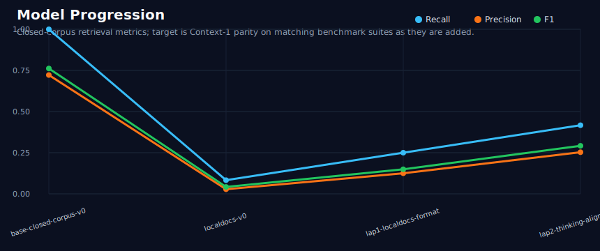

# golden-retriever

A small-model agentic retrieval lab inspired by Chroma's Context-1 research, targeting MiniCPM5-1B as a fast retrieval subagent that can run many workers in parallel.

## Why this exists

Context-1 reframes retrieval as an agent loop rather than a one-shot vector search. A retrieval subagent decomposes the query, searches, reads promising snippets, prunes low-value context, and returns ranked evidence for a downstream reasoning model.

MiniCPM5-1B is a promising base for this style of work because it is:

- small enough for cheap iteration and local fine-tuning experiments;
- Llama-compatible, so mainstream inference stacks can load it directly;
- already tuned toward agentic/tool-use behavior;
- fast enough on a consumer GPU to explore 4x/8x/16x parallel retrieval workers.

Initial local benchmark on Michael's RTX 5060 Ti:

- **~196.6 output tok/s** for a single active request.
- **~6,414.5 output tok/s** batched throughput with vLLM.
- Full details: [`benchmarks/minicpm5-1b-rtx5060ti.md`](benchmarks/minicpm5-1b-rtx5060ti.md)

## Project goals

1. Reproduce the shape of Context-1's retrieval subagent loop using an open harness.
2. Extend Pi with the retrieval tools named in Chroma's whitepaper prompt:
   - `SearchTool` — hybrid semantic + keyword search.
   - `GrepTool` — text pattern matching.
   - `ReadDocument` — read targeted document snippets.
   - `PruneChunksTool` — remove irrelevant chunks to free context budget.
3. Generate traces that can be used for supervised fine-tuning / preference optimization of MiniCPM5-1B.
4. Evaluate parallel retrieval swarms: 1, 4, 8, and 16 retrieval agents working different query facets.
5. Keep the harness model-agnostic: local vLLM, llama.cpp/GGUF, Pi integration, or external OpenAI-compatible endpoints.

## Current status

This repo is the initial scaffold:

- local retrieval tool contracts and a simple filesystem corpus backend;
- a prompt template matching the Context-1 retrieval-subagent role;
- a minimal harness that can emit tool-enabled prompts and collect evidence;
- typed JSONL dataset schema plus quote-grounding validation;
- initial retrieval metrics matching the Context-1 report;
- benchmark script for MiniCPM5-1B on vLLM;
- implementation roadmap for Pi integration and data generation.

<!-- metrics-progress:start -->
## Progression



Tracked in [`docs/experiments.md`](docs/experiments.md). The graph shows local proxy smoke/regression benchmarks only; Context-1 parity now tracks full public-suite/tool-loop adapters. See [`docs/context-1-source-inventory.md`](docs/context-1-source-inventory.md) and [`docs/plans/2026-07-06-context-1-full-scale-parity.md`](docs/plans/2026-07-06-context-1-full-scale-parity.md).

### Context-1 parity benchmark matrix

| Suite | Status | Notes |
|---|---|---|
| Generated legal / patent / web / finance retrieval | planned full-scale | Chroma recipe uses web, SEC/finance, patents/legal, and Epstein/email task generation with verification, distractors, and chained hops. Local `synthdomains-v1` is now only smoke/regression. |
| Public LongSeal | planned first adapter | Fixed-corpus 512-token chunking makes it the best first comparable public suite. |
| Public Seal-0 | planned | Requires positive URL dataset and browsing/scraping/static snapshot adapter. |
| Public FRAMES | planned | Requires Wikipedia/Serper-style retrieval adapter or static Wikipedia snapshot, plus positive URL coverage filtering. |
| Public HotpotQA | planned sanity suite | Simpler benchmark expected to saturate; useful for harness validation, not sufficient for parity. |
| BrowseComp+ | access TBD | Needs reproducible static corpus/source access; live web BrowseComp is not comparable. |
<!-- metrics-progress:end -->

## Quick start

```bash
uv venv --python python3.12
source .venv/bin/activate
uv pip install -e '.[dev]'
pytest -q
```

Run the simple local harness against a folder of text files:

```bash
python -m golden_retriever.harness \
  --corpus ./docs \
  --query "What tools should the retrieval subagent have?"
```

Validate a JSONL retrieval-task dataset:

```bash
golden-retriever-validate data/seed/tasks.jsonl --corpus-root docs
```

Generate deterministic local-doc retrieval tasks:

```bash
golden-retriever-generate \
  --corpus-root data/generated/localdocs-v0/corpus \
  --output data/generated/localdocs-v0/tasks.jsonl \
  --limit 20 \
  --distractors 3 \
  --domain localdocs
```

Build chat-format SFT examples:

```bash
golden-retriever-build-sft \
  --dataset data/generated/localdocs-train-v0/tasks.jsonl \
  --corpus-root data/generated/localdocs-v0/corpus \
  --output data/sft/localdocs-thinking-lap2/train.jsonl \
  --include-thinking
```

Run a minimal LoRA SFT lap from an environment with Torch/Transformers/PEFT installed:

```bash
golden-retriever-train-lora-sft \
  --model openbmb/MiniCPM5-1B \
  --train-file data/sft/localdocs-thinking-lap2/train.jsonl \
  --output-dir models/minicpm5-1b-localdocs-thinking-lap2-aligned-lora-8192-e8 \
  --epochs 8 \
  --max-length 8192 \
  --target-modules q_proj,v_proj \
  --enable-thinking
```

Run the current base-model closed-corpus eval, assuming a vLLM server is listening on `:8000`:

```bash
golden-retriever-model-eval \
  --dataset data/base_smoke/tasks.jsonl \
  --corpus-root data/base_smoke/corpus \
  --model openbmb/MiniCPM5-1B \
  --base-url http://127.0.0.1:8000/v1 \
  --max-tokens 2048 \
  --output results/base-minicpm5/base-smoke-closed-corpus.json
```

Re-run the MiniCPM5-1B benchmark:

```bash
./scripts/bench_minicpm5_vllm.sh
```

## References

- Chroma Context-1 technical report: https://www.trychroma.com/research/context-1
- Pi agent harness: https://pi.dev/
- MiniCPM5-1B: https://huggingface.co/openbmb/MiniCPM5-1B
